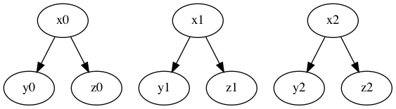

# Find the connected components of a graph (that's represened as a `.dot` file)


```
digraph G {

        x0 -> y0;
        x0 -> z0;
    
        x1 -> y1;
        x1 -> z1;
    
        x2 -> y2;
        x2 -> z2;

}
```

The graph has three connected components:


## Try it out:

1. Clone or download this tiny repo
1. `python3 -m venv venv`
1. `source venv/bin/activate`
1. `pip install requirements.txt`
1. `python print_connected_components.py`

### output
```
(venv) Matts-Mac-mini:DisconnectedGraphs mpayne$ python print_connected_components.py
Component 1: {'y0', 'z0', 'x0'}
Component 2: {'x1', 'z1', 'y1'}
Component 3: {'z2', 'x2', 'y2'}
(venv) Matts-Mac-mini:DisconnectedGraphs mpayne$
```

## References (thanks to Justin R from the awesome community at Recurse.com)

1. To read a graphviz `.dot` file https://networkx.org/documentation/stable/reference/drawing.html?highlight=nx_pydot#module-networkx.drawing.nx_pydot
1. To find the connect components of a graph https://networkx.org/documentation/stable/reference/algorithms/generated/networkx.algorithms.components.connected_components.html#networkx.algorithms.components.connected_components

